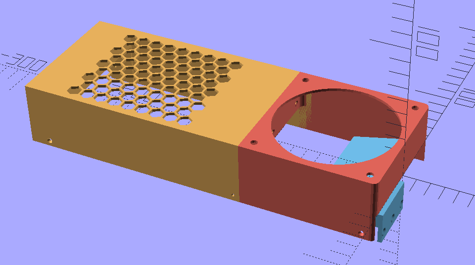
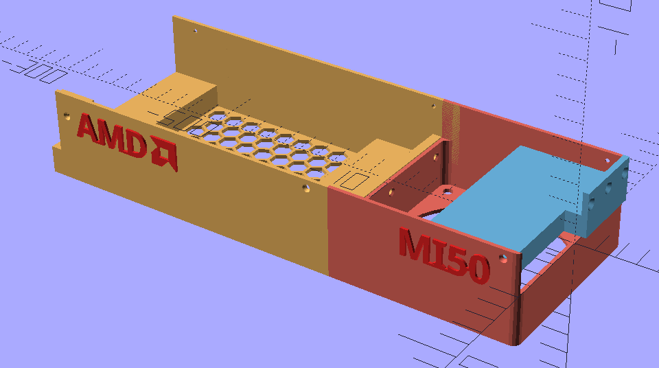

# AMD MI50 Desktop Cooling Shroud

Open source cooling solution for the **AMD Radeon Instinct MI50** (Vega 20). 
Designed to replace loud server blowers with 92mm standard desktop fan and acceptable noise.
OpenScad project, modular, designed to be easy to print on commons 25cm x 25cm printers.

The conception is specifically tailored for **92mm x 92mm x 25mm fans** (I recommend the **Arctic P9 Max**  for its high static pressure and affordability).

---




---

## Features
- **Three-Part Design:** Separate fan mount, heatsink duct, and logo plate for easier printing and assembly.
- **Factory Fit:** Uses the original M2 mounting points on the MI50 PCB. (Requires longer M2 screws than original)
- **Ducting:** Engineered to force air through the heatsink fins for efficient cooling


## Project Structure
- `shroud.scad`: Main design file.
- `letters.scad`: Font helper
- `export.sh`: Bash script for automated STL generation.
- `lib/`: Helper geometries
- `output/`: Generated STL files.


## Exporting STLs
With OpenSCAD installed, run the export script to generate all parts:

```bash
chmod +x export.sh
./export.sh
```

You will find the STLs in the `output/` folder


## Printing Tips

- Material: Use PETG or ABS. Standard PLA may soften under the heat generated during heavy LLM inference.
- Infill: 20% or higher.
- Walls: Use at least 2 perimeters for the screw holes to ensure they don't crack.

## License

MIT